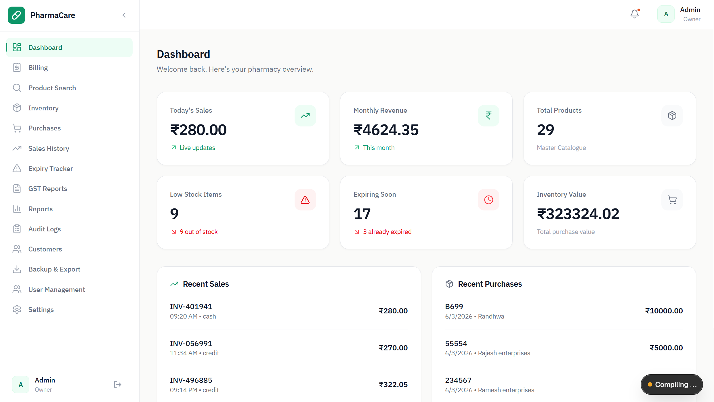
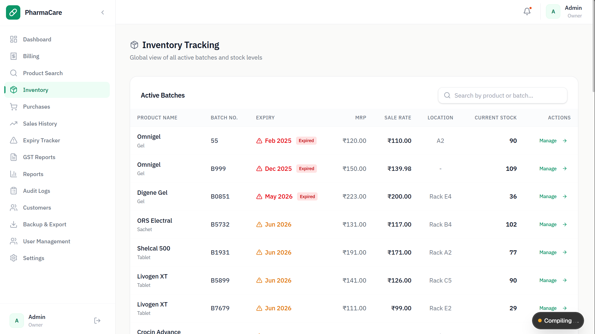
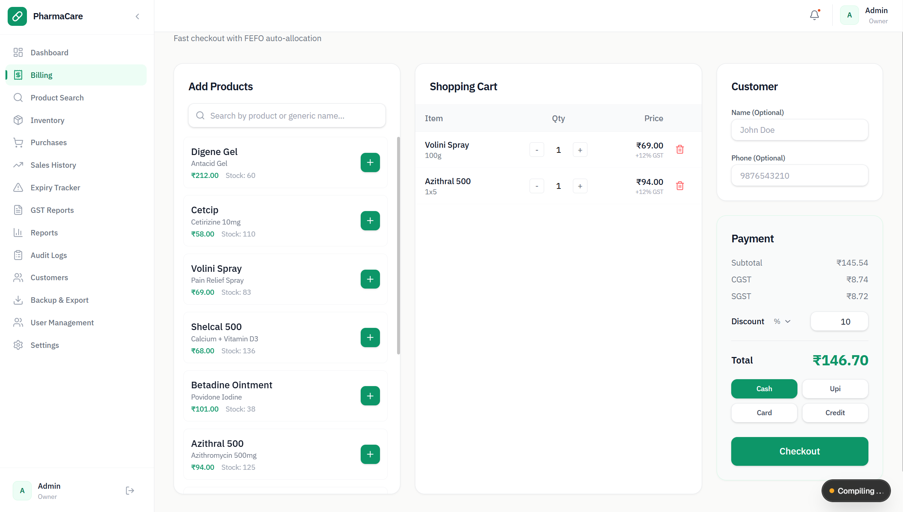

# PharmaCare ERP

A pharmacy management system built to digitize inventory, billing, purchases, and stock operations for small and medium-sized medical stores.

The project was developed after observing how many pharmacies still rely on handwritten registers for inventory tracking, purchase records, and billing. The goal was to build a practical ERP that addresses real operational problems such as batch tracking, expiry monitoring, GST-compliant billing, stock reconciliation, and auditability.

Unlike generic inventory systems, PharmaCare focuses on pharmacy-specific workflows including FEFO inventory handling, batch-wise stock management, multi-unit inventory conversion, and expiry-based stock monitoring.

---

## Screenshots

### Dashboard



### Inventory Tracking



### Billing



---

## Development Context

The project originated from studying day-to-day workflows in a local medical store where inventory and purchase records were being maintained manually.

The system is being developed around actual pharmacy requirements rather than generic inventory assumptions. Inventory movement, batch tracking, GST calculations, expiry management, and reporting workflows were designed with real-world operational constraints in mind.

---

## Core Features

### Inventory Management

* Batch-wise inventory tracking
* Multi-unit stock management
* Product master management
* Inventory adjustments
* Stock valuation
* Low stock monitoring
* Reorder level tracking
* Product search and filtering

### Multi-Unit Inventory

Supports inventory conversion between:

* Box → Strip → Tablet
* Box → Capsule
* Bottle → ml
* Pack → Sachet

Examples:

* Purchase 1 strip containing 15 tablets
* Sell 2 tablets
* Inventory automatically updates remaining quantity

This prevents stock inaccuracies common in pharmacy environments.

### Batch Management

* Batch-wise stock tracking
* Manufacturing date tracking
* Expiry date tracking
* Batch-level inventory visibility
* Batch search
* Batch-specific reporting

### FEFO Inventory Logic

First Expiry First Out (FEFO) implementation.

When a medicine exists in multiple batches:

* The system automatically prioritizes the earliest valid expiry batch
* Older inventory is sold first
* Reduces expiry-related losses

### Billing & Sales

* GST-compliant billing
* Invoice generation
* Sales history
* Invoice search
* Invoice reprint
* Discount handling
* Multiple payment methods (cash, UPI, card, credit)
* Sales analytics

### Purchase Management

* Purchase entry
* Supplier management
* Purchase history
* Batch creation during purchase
* Automatic inventory updates
* Purchase reporting

### Expiry Monitoring

* Expired stock tracking
* 30-day alerts
* 60-day alerts
* 90-day alerts
* Expiry dashboards
* Expiry valuation reports

### GST Management

* HSN code support
* CGST calculations
* SGST calculations
* IGST calculations
* GST reporting
* Tax summaries
* GST-ready invoice generation

### Reporting

Inventory Reports

* Stock reports
* Inventory valuation
* Low stock reports
* Batch reports

Sales Reports

* Daily sales
* Weekly sales
* Monthly sales
* Product-wise reports

Purchase Reports

* Purchase summaries
* Supplier reports

GST Reports

* Tax collection summaries
* GST breakdown reports

### Data Export & Recovery

* Inventory CSV export
* Sales CSV export
* Purchase CSV export
* GST CSV export
* Customer CSV export
* Full backup generation

The philosophy is simple:

> Your business data should remain portable and accessible at all times.

---

## Technical Focus

Most pharmacy management demos focus heavily on dashboards and visual presentation.

This project focuses on operational correctness.

Primary engineering priorities:

* Batch-level inventory accuracy
* FEFO stock deduction
* GST calculation correctness
* Inventory reconciliation
* Multi-unit inventory conversion
* Expiry management
* Stock movement auditability
* Consistent reporting

A significant portion of development effort was spent on business logic, inventory consistency, and pharmacy-specific workflows rather than purely visual design.

---

## System Modules

* Authentication & Authorization
* User Management
* Dashboard
* Medicine Master
* Inventory Management
* Batch Management
* Supplier Management
* Purchase Management
* Billing & Sales
* GST Management
* Expiry Tracking
* Reporting
* Audit Logs
* CSV Export & Backup

---

## Security

Current security measures include:

* Role-based access control (owner / staff roles)
* Protected application routes via NextAuth middleware
* JWT session management (24-hour expiry)
* Password hashing with bcrypt
* Input validation with Zod
* Audit-oriented inventory workflows

Future enhancements:

* Two-factor authentication
* Advanced audit logging
* Automated backup verification

---

## Technology Stack

**Frontend**

* Next.js 16 (App Router)
* React 19
* TypeScript
* Tailwind CSS v4

**Backend**

* Next.js Server Actions & API Routes
* NextAuth v5 (JWT strategy)
* TypeScript

**Database**

* SQLite via libsql / Turso
* Drizzle ORM

**Tooling**

* Drizzle Kit (migrations)
* tsx (seed scripts)
* ESLint

---

## Project Goals

Building a pharmacy-focused ERP that handles the operational workflows a medical store actually runs on:

* Batch-wise stock deduction with FEFO ordering
* GST-compliant invoices with CGST/SGST/IGST breakdown
* Expiry monitoring across all active batches
* Purchase entry that creates/updates batches and adjusts inventory atomically
* Audit trail on every stock movement
* CSV exports so data is never locked in

Inventory correctness takes priority over dashboard aesthetics.

---

## Roadmap

Planned improvements:

* Barcode scanning
* QR code support
* Android application
* WhatsApp invoice sharing
* Advanced reporting
* Prescription management
* Customer credit tracking
* Supplier analytics
* Inventory forecasting
* Automated reorder recommendations

---

## Running Locally

```bash
git clone https://github.com/<your-username>/pharmacare-erp.git

cd pharmacare-erp

npm install

cp .env.example .env
# Fill in DATABASE_URL and AUTH_SECRET in .env

npm run db:push        # Apply schema to database

npm run db:seed        # (Optional) Seed initial data

npm run dev
```

Open [http://localhost:3000](http://localhost:3000) in your browser.

---

## Environment Variables

Copy `.env.example` to `.env` and fill in the values:

| Variable | Description |
|---|---|
| `DATABASE_URL` | libsql/Turso connection string (e.g. `file:local.db` for local SQLite) |
| `AUTH_SECRET` | Secret key for NextAuth JWT signing (min 32 characters) |
| `AUTH_URL` | Base URL of the application (e.g. `http://localhost:3000`) |
| `NEXT_PUBLIC_APP_NAME` | Display name shown in the UI |

---

## License

MIT

---
## Other Projects

This repository primarily demonstrates backend architecture, business logic, inventory workflows, GST-compliant billing, batch management, and pharmacy operations.

The focus of PharmaCare was building a practical system that solves real operational problems rather than creating a visually flashy interface.

For projects with a stronger focus on frontend engineering, motion design, animations, and interactive user experiences, see:

### Interactive Vodka Brand Experience

Advanced frontend project focused on motion design, immersive scrolling experiences, animation systems, and creative web interactions.

Repository:
[vodka-brand-experience](https://github.com/ishaanpadashetty/vodka-brand-experience)


## Project Focus

PharmaCare emphasizes:

* Inventory management
* Batch-wise stock tracking
* FEFO inventory workflows
* GST-compliant billing
* Purchase management
* Expiry monitoring
* Pharmacy operations
* Data integrity and reporting
* Security-conscious development practices

Rather than visual effects, the goal of this project was to model real-world pharmacy workflows and operational requirements.
